# JSP-Bulletin-Board-System

## 게시판
- ### 메인 페이지  
  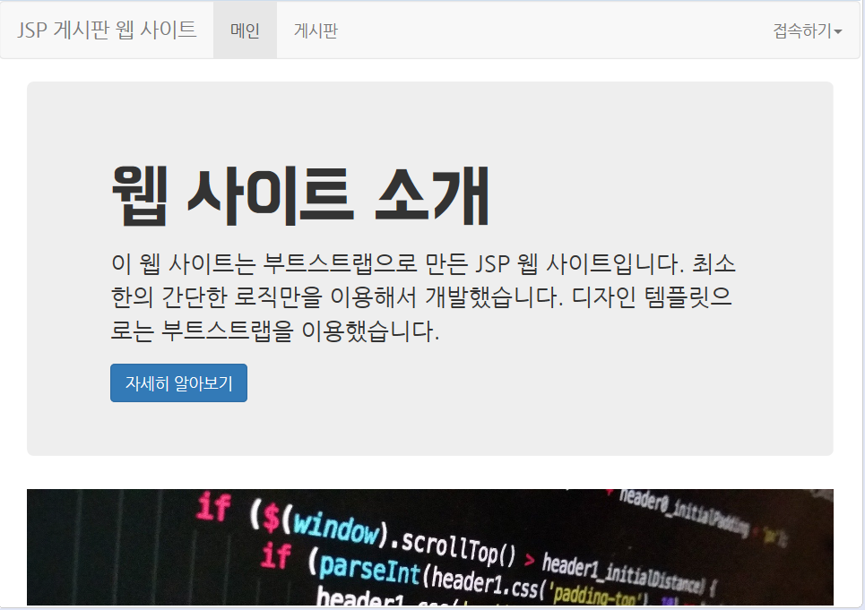  
  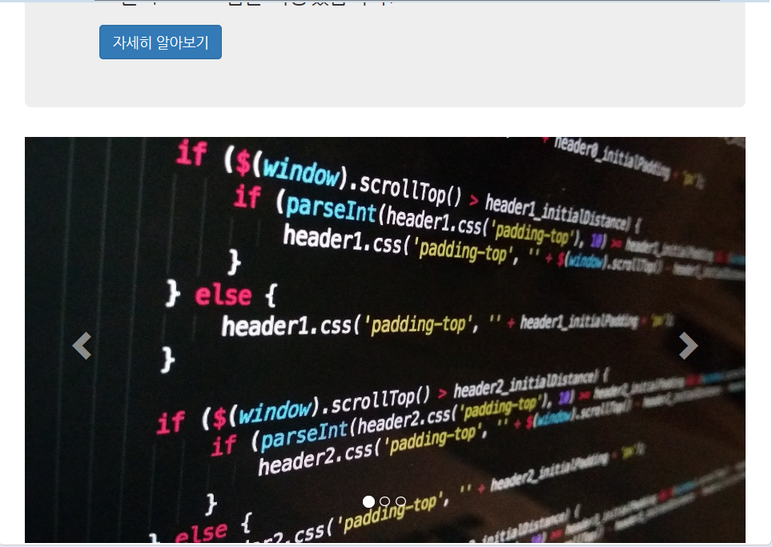  
  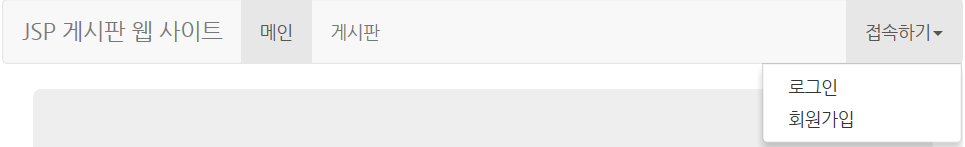  
  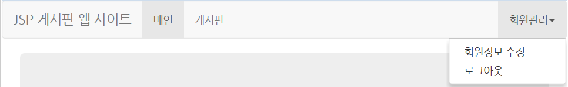  
   
  - 메인을 누르면 메인 페이지으로 이동합니다.  
  - 게시판을 누르면 게시판 페이지으로 이동합니다.  
  - 접속하기를 누르면 로그인과 회원가입이 표시됩니다.  
  - 로그인할 시 접속하기가 회원관리로 바뀌어 표시됩니다.  
  - 회원관리를 누르면 회원정보 수정과 로그아웃이 표시됩니다.

 

- ### 회원가입 페이지
  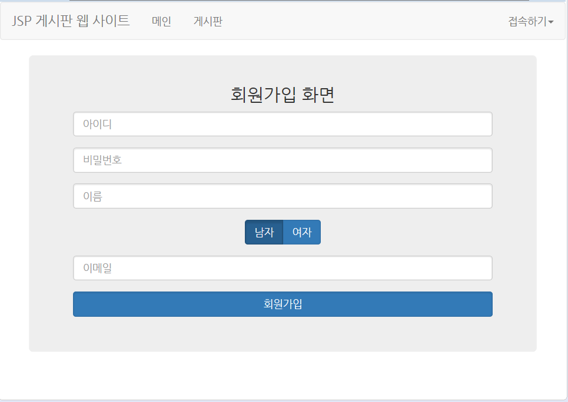  
   
  - 아이디, 비밀번호, 이름, 성별, 이메일을 차례대로 입력하고 회원가입 버튼을 누르면 회원가입이 완료됩니다.  
  - 모든 항목은 빠짐없이 입력해야 합니다.  
  - 회원가입이 완료되면 로그인 된 채로 메인 페이지로 이동합니다.

 

- ### 로그인 페이지
  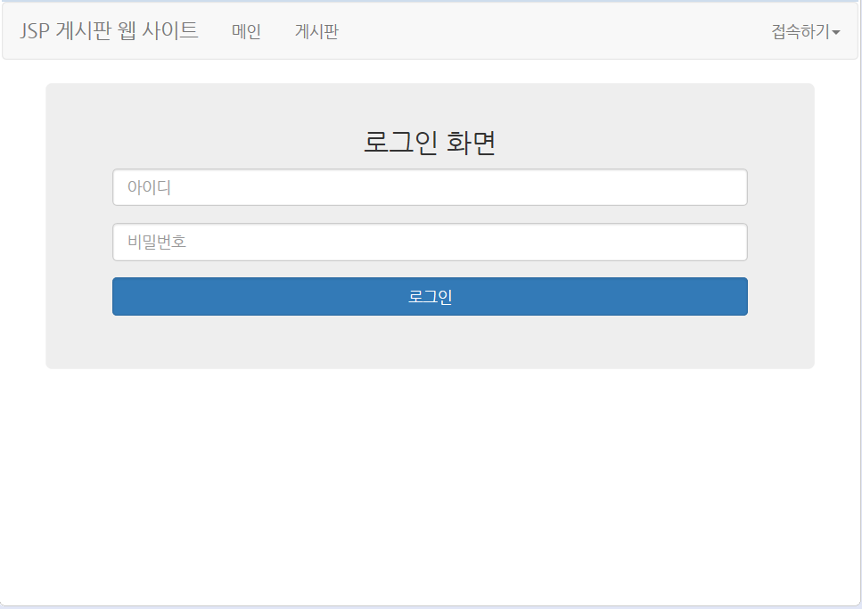  
   
  - 아이디, 비밀번호를 차례대로 입력하고 로그인을 누르면 로그인이 완료됩니다.  
  - 모든 항목은 빠짐없이 입력해야 합니다.  
  - 로그인이 완료되면 로그인된 채로 메인 페이지로 이동합니다.

 

- ### 게시판 페이지
  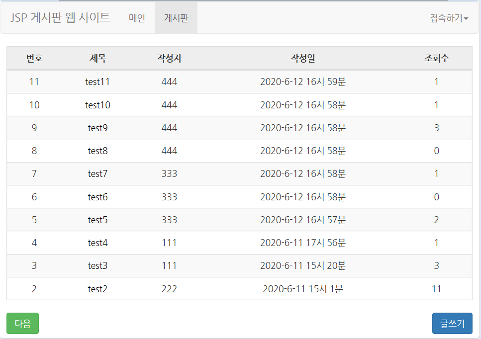  
    
   
  - 이 페이지는 로그인 여부에 관계없이 볼 수 있습니다.  
  - 글 목록응 10개씩 보여지며 글 개수가 11개 이상일 경우 다음 페이지로 넘어갈 수 있는 버튼이 생깁니다.  
  - 다음 버튼을 누르면 다음 페이지로 이동합니다.  
  - 첫 번째 페이지가 아닐 시 이전 페이지로 넘어갈 수 있는 버튼이 생깁니다.  
  - 이전 버튼을 누르면 이전 페이지로 이동합니다.  
  - 글 목록 중 특정 글의 제목을 클릭하면 해당 글의 조회수가 증가하며 글 내용을 볼 수 있습니다.  
  - 글쓰기 버튼을 클릭하면 게시글 쓰기 페이지로 이동합니다.

 

- ### 게시글 페이지
  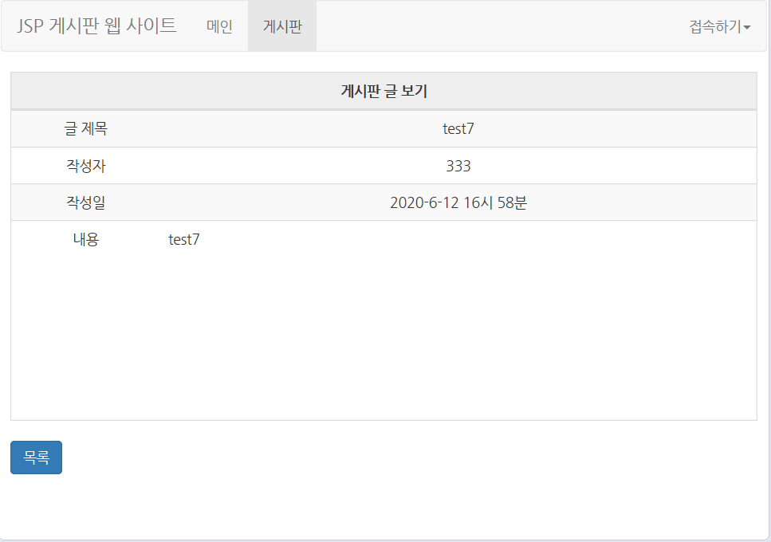  
  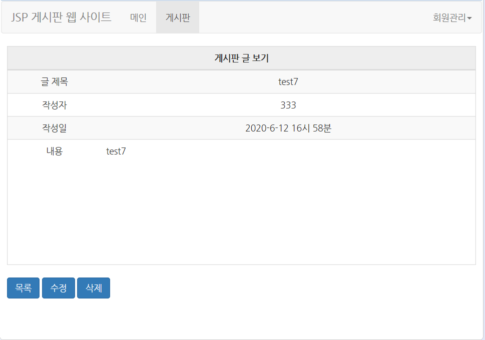  
   
  - 이 페이지는 로그인 여부에 관계없이 볼 수 있습니다.  
  - 목록 버튼을 누르면 게시판 페이지로 이동합니다.  
  - 수정 버튼을 누르면 게시글 수정 페이지로 이동합니다.  
  - 삭제 버튼을 누르면 게시글이 삭제되고 게시판 페이지로 이동합니다.  
  - 해당 글의 작성자가 아닐 시 수정과 삭제를 할 수 없습니다. 목록 버튼만 표시됩니다.

 

- ### 게시글 쓰기 페이지
  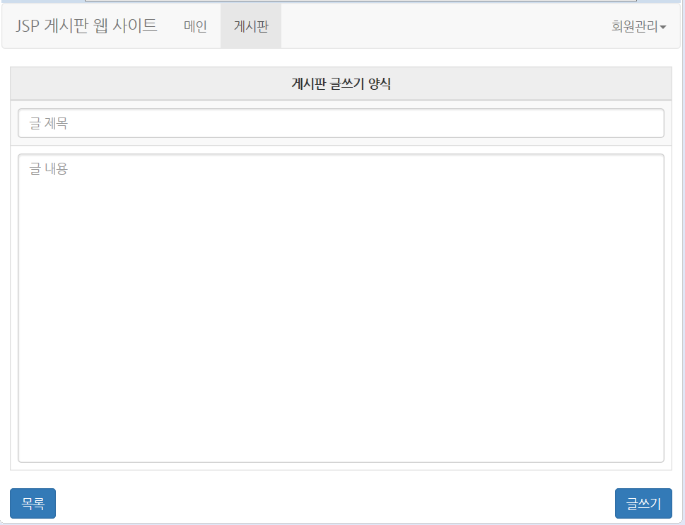  
   
  - 이 페이지는 로그인 여부에 관계없이 볼 수 있습니다.  
  - 제목과 내용을 입력하고 글쓰기 버튼을 누르면 게시글이 작성되며 게시판 페이지로 이동합니다.  
  - 로그인을 하지 않을 시 게시글은 작성할 수 없으며 로그인 페이지로 이동합니다.  
  - 목록 버튼을 누르면 게시판 페이지로 이동합니다.

 

- ### 게시글 수정 페이지
  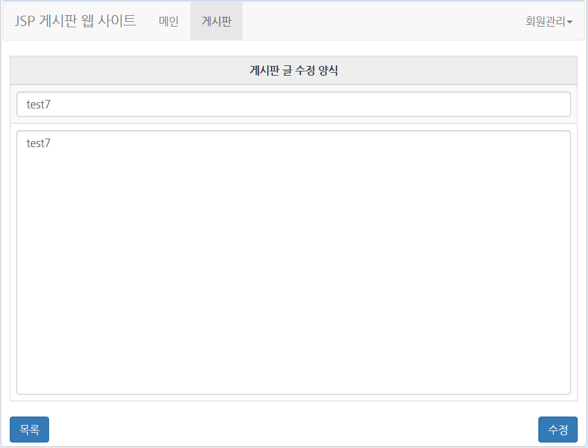  
   
  - 해당 게시글의 제목과 내용이 표시됩니다.  
  - 제목과 내용을 입력하고 수정 버튼을 누르면 게시글이 수정되며 게시판 페이지로 이동합니다.  
  - 목록 버튼을 누르면 게시판 페이지로 이동합니다.

 

- ### 회원정보 수정 페이지
  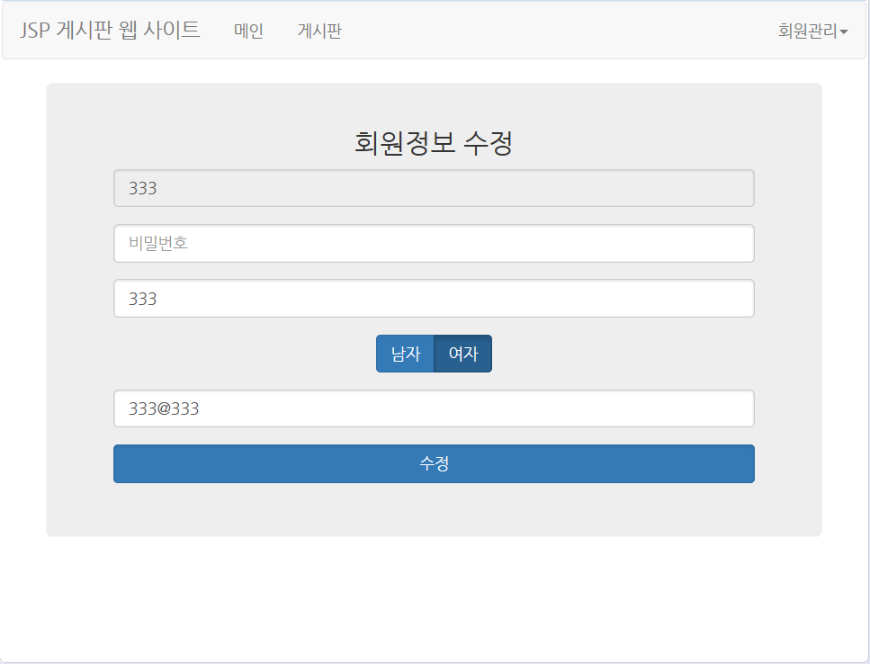  
   
  - 로그인을 해야지만 이 페이지를 볼 수 있습니다.  
  - 아이디는 변경할 수 없습니다.  
  - 비밀번호, 이름, 성별, 이메일을 차례대로 입력하고 수정 버튼을 누르면 회원정보 수정이 완료됩니다.  
  - 모든 항목은 빠짐없이 입력해야 합니다.  
  - 수정이 완료되면 로그인 된 채로 메인 페이지로 이동합니다.

  

## 참고
- Youtube강좌: <https://www.youtube.com/watch?v=wEIBDHfoMBg&list=PLRx0vPvlEmdAZv_okJzox5wj2gG_fNh_6&index=1>
